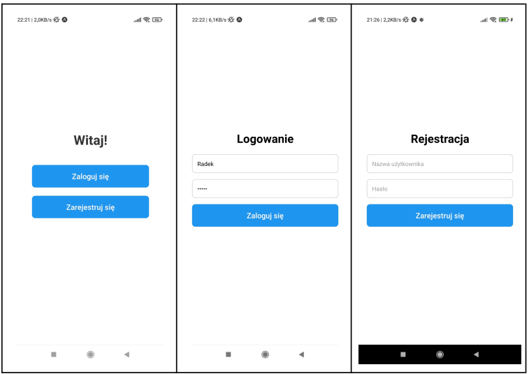
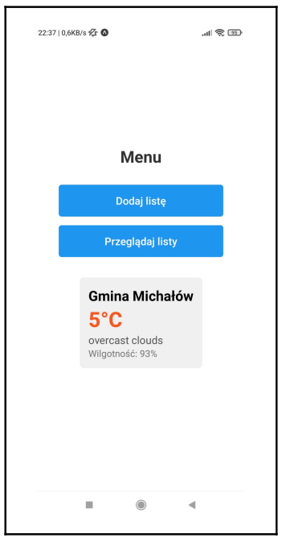
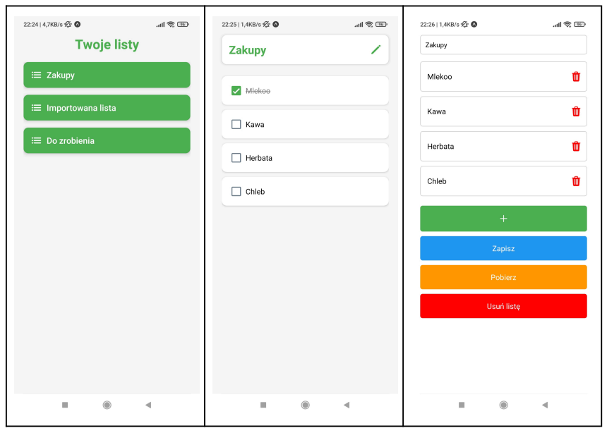
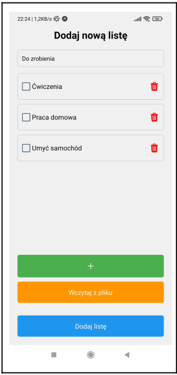

# Todo List Bai

Aplikacja mobilna umożliwiająca zarządzanie listami zadań.  
Użytkownicy mogą tworzyć, edytować oraz usuwać swoje listy, zapisywać je i pobierać w formacie JSON.  
System wspiera pełną autentykację użytkowników przy użyciu tokenów JWT oraz zabezpieczenia przed nieautoryzowanym dostępem.  
Do komunikacji z backendem wykorzystywane jest API oparte na metodach HTTP (GET, POST, PUT, DELETE). 
Mechanizmy bezpieczeństwa aplikacji obejmują uwierzytelnianie użytkowników, zarządzanie tokenami, hashowanie haseł oraz generowanie unikalnych identyfikatorów, zapewniając ochronę danych i bezpieczeństwo systemu.

---

## Zrzuty ekranu

### Ekran powitalny, logowania i rejestracji

  

---

### Menu główne z pogodą

---

### Widok list zadań oraz szczegóły i edycja listy

---

### Dodawanie nowej listy

---
